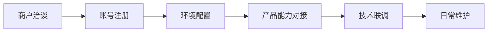
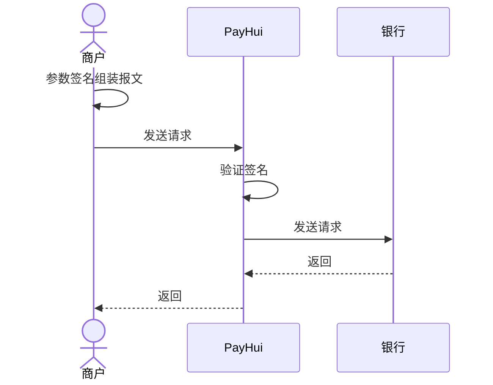

PayHui旨在提供安全便捷的海外本地化支付服务和国际信用卡支付服务，目前覆盖全球的150+个国家地区；可支持的服务包括全球收单、全球付款、本地收款等。

# 接入流程
* 更新时间：2023-02-16 21:31:02

PayHui旨在提供安全便捷的海外本地化支付服务和国际信用卡支付服务，目前覆盖全球的150+个国家地区；可支持的服务包括全球收款、付款等。

为了保证顺利接入，该文档提供了标准的PayHui产品接入流程。

## 整体流程


## 交互流程


## 具体步骤
### 商务洽谈
 通过与我司商务进行前期的沟通；确定好合作方式及选择需要接入的服务和产品。详细见：[【商户合作入口】](https://global.payhui.com/app/login)。

### 账号注册
在确定接入PayHui后，自动注册。[【注册入口】](https://global.payhui.com/app/signup)，提交材料，等待系统审核。

### 环境配置


请您先在测试环境完成测试，随后提供一笔成功单和一笔失败单在对接群联系技术支持开通正式环境。

#### 测试环境

1) 登录【开发者平台】。

2) 新增收单支付方式（KYB提交材料）。
#### 正式环境
开通正式环境后，请在 Merchant Dashboard 重新配置正式环境的公钥和回调地址，并获取相关开发参数。

### 技术联调
1) 由我司商务人员创建联调对接群，开展技术对接。
1) 联调完成后，请在测试环境发起一笔成功单和一笔失败单并提供到对接群里，完成生产环境开通。

:::tip

目前收款、付款、token支付、链接支付等产品，只要收到PayHui响应，无论订单成功还是失败，请响应

``` json
 {"errMessage":"Success","errCode":"00000000"}
```
，详细请参考【支付结果通知】。

:::

### 日常维护
对接阶段完成，后续关注交易情况并进行日常维护即可。
